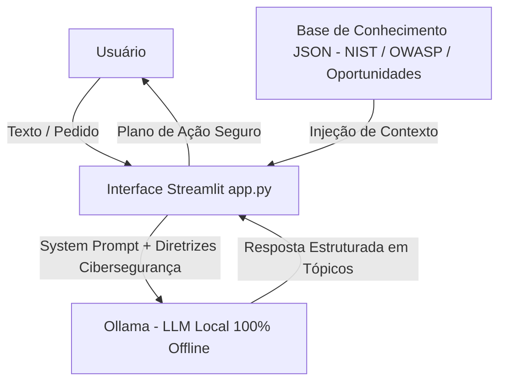

# 🛡️ Agente MBA - Copiloto de Negócios, Ciência de Dados & Cibersegurança

> Agente de IA Generativa local e offline (Streamlit + Ollama) que processa textos, identifica oportunidades de monetização em Ciência de Dados, Engenharia e Cibersegurança, e gera planos de ação pragmáticos garantindo conformidade com a LGPD e diretrizes OWASP.

---

## 💡 O Que é o Agente MBA?

O **Agente MBA** é um assistente analítico desenhado para integrar teoria técnica com **aplicação prática de mercado e governança de dados**. Ele analisa relatórios corporativos, artigos ou ideias de projetos e devolve um planejamento estratégico estruturado, focado em geração de renda e segurança da informação.

### **O que o Agente MBA faz:**
- ✅ **Processa e analisa textos:** Transforma dados brutos em planos de ação de negócios.
- ✅ **Identifica oportunidades de monetização:** Mapeia freelas, consultorias e produtos digitais em Ciência de Dados, Engenharia Civil (PropTech) e SecOps.
- ✅ **Garante Cibersegurança & LGPD:** Analisa requisitos de anonimização, controle de acesso (RBAC), criptografia e prevenção contra Prompt Injection (*OWASP Top 10 para LLMs*).
- ✅ **Mapeia habilidades técnicas (*Just-in-Time*):** Indica exatamente o que estudar (Python, SQL, NIST, Ollama) para executar cada projeto.
- ✅ **Responde com limite estrito:** Executa apenas o que foi solicitado, de forma concisa e sem divagações.

### **O que o Agente MBA NÃO faz:**
- ❌ **Não envia dados para a nuvem:** Opera 100% offline via Ollama local com soberania total de dados (*Zero Data Leakage*).
- ❌ **Não substitui pareceres jurídicos/financeiros formais:** Oferece direcionamento estratégico, mas sinaliza a necessidade de validação técnica.
- ❌ **Não executa comandos no sistema operacional autonomamente:** Entrega instruções e código para revisão do usuário.

---

## 🏗️ Arquitetura



**Stack Tecnológica:**
- **Interface:** Streamlit
- **Motor LLM:** Ollama (Modelo local `llama3.2` ou `mistral` via HTTP na porta `11434`)
- **Linguagem:** Python 3.10+
- **Base de Conhecimento:** JSON local (`data/`)

---

## 📁 Estrutura do Projeto

```text
├── app.py                          # Aplicação web interativa em Streamlit integrada ao Ollama local
├── requirements.txt                # Dependências Python (streamlit, ollama, requests, pandas)
│
├── data/                           # Base de conhecimento local (JSON)
│   ├── oportunidades_data_science.json  # Perfil do usuário, oportunidades em dados/engenharia e SecOps
│   └── frameworks_negocios.json         # Normas NIST, OWASP para LLMs, SWOT, Lean MVP e precificação
│
├── docs/                           # Documentação completa dos passos do desafio (Padrão DIO)
│   ├── 01-documentacao-agente.md   # Passo 1: Caso de uso, persona, escopo e cibersegurança
│   ├── 02-base-conhecimento.md     # Passo 2: Mapeamento de dados e fontes utilizadas
│   ├── 03-prompts.md               # Passo 3: System Prompt, Few-Shot e tratamento de Edge Cases
│   ├── 04-metricas.md              # Passo 4: Matriz de avaliação, testes de prompt injection e latência
│   └── 05-pitch.md                 # Passo 5: Roteiro e checklist do pitch de 3 minutos
│
├── examples/                       # Referências e guias de implementação
│   └── README.md                   # Tabela comparativa das etapas do desafio
│
├── src/                            # Instruções do código fonte
│   └── README.md                   # Estrutura do app.py e guia de execução
│
└── assets/                         # Recursos visuais e roteiro do desafio
    ├── README.md                   # Mapeamento de assets do repositório
    └── RoteiroLab.md               # Roteiro oficial de vídeos do laboratório DIO
```

---

## 🚀 Como Executar o Projeto

### Pré-requisitos:
1. Python 3.10 ou superior instalado.
2. [Ollama](https://ollama.com) instalado e rodando na sua máquina.
3. Modelo de linguagem baixado no Ollama (ex: `ollama run llama3.2`).

### Passo a Passo:

1. **Clonar o repositório:**
   ```bash
   git clone https://github.com/NizaoSilva/dio-lab-bia-do-futuro.git
   cd dio-lab-bia-do-futuro
   ```

2. **Instalar as dependências Python:**
   ```bash
   pip install -r requirements.txt
   ```

3. **Verificar se o Ollama está em execução:**
   ```bash
   ollama list
   ```

4. **Iniciar a aplicação Streamlit:**
   ```bash
   streamlit run app.py
   ```

5. Acesse a aplicação no seu navegador em: `http://localhost:8501`.
