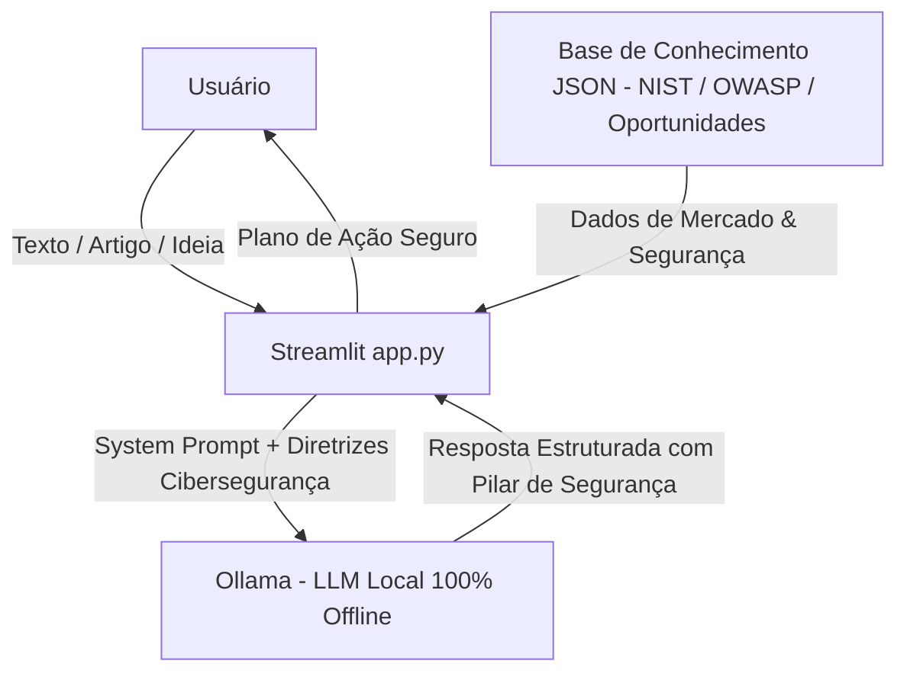

# 🛡️ Agente MBA - Copiloto de Negócios, Ciência de Dados & Cibersegurança

> Agente de Inteligência Artificial Generativa local e offline (Streamlit + Ollama) projetado para processar textos, identificar oportunidades de monetização em Ciência/Engenharia de Dados e Cibersegurança, garantindo conformidade com LGPD e diretrizes OWASP.

---

## 💡 O Que é o Agente MBA?

O **Agente MBA** é um assistente analítico focado na ponte entre teoria e **aplicação prática de mercado com segurança da informação**. Ele analisa textos, relatórios corporativos ou ideias de projetos e devolve um planejamento estruturado focado em geração de valor, renda e governança de dados.

### 🌟 Destaques do Projeto:
- 🛡️ **Foco em Cibersegurança & LGPD:** Avaliação nativa de riscos de privacidade, controle de acesso e segurança da informação.
- 🔒 **100% Local e Gratuito (Zero Data Leakage):** Executado no seu computador via [Ollama](https://ollama.com) com total soberania de dados.
- ✅ **Execução Estrita:** Responde exatamente o que foi solicitado, no formato estruturado desejado.
- 📊 **Interface Web Prática:** Desenvolvida em Streamlit com histórico de conversa e seleção de modelos locais.

---

## 🏗️ Arquitetura do Sistema



---

## 📁 Estrutura do Repositório

```text
├── app.py                         # Aplicação principal em Streamlit com foco em Cibersegurança
├── requirements.txt               # Dependências Python (streamlit, ollama, requests, pandas)
├── data/                          # Base de conhecimento local (incluindo OWASP e NIST)
│   ├── oportunidades_data_science.json
│   └── frameworks_negocios.json
└── docs/                          # Documentação dos 6 passos do desafio
    ├── 01-documentacao-agente.md  # Escopo, persona, arquitetura e Cibersegurança
    ├── 02-base-conhecimento.md    # Estrutura dos dados de conhecimento
    ├── 03-prompts.md              # System Prompt e proteção anti-prompt injection
    ├── 04-metricas.md             # Matriz de avaliação e testes de segurança
    └── 05-pitch.md                # Pitch do projeto com destaque em Cibersegurança
```

---

## 🚀 Como Executar o Projeto

### Pré-requisitos:
1. Python 3.10+ instalado.
2. [Ollama](https://ollama.com) instalado e em execução na máquina local.
3. Modelo baixado no Ollama (exemplo: `ollama run llama3.2`).

### Passo a Passo:

1. **Instalar as dependências:**
   ```bash
   pip install -r requirements.txt
   ```

2. **Garantir que o Ollama está rodando:**
   ```bash
   ollama list
   ```

3. **Iniciar a aplicação Streamlit:**
   ```bash
   streamlit run app.py
   ```

4. Acesse no seu navegador: `http://localhost:8501`.
