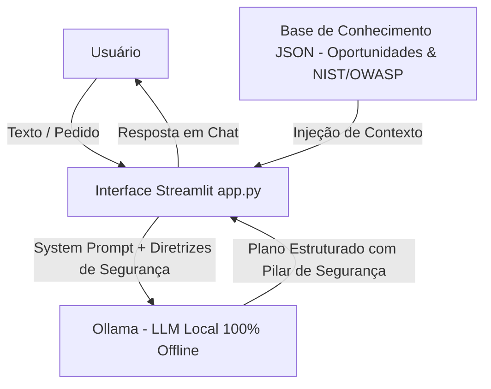

# 💼 Agente MBA - Documentação e Escopo

## 1. Caso de Uso
O **Agente MBA (Copiloto de Negócios, Aprendizado e Cibersegurança)** foi concebido para atender profissionais e estudantes (com foco em Engenharia Civil, Ciência/Engenharia de Dados e Segurança da Informação) que necessitam de:
- **Processamento e Síntese de Texto:** Leitura analítica de estudos de caso, relatórios corporativos e ideias de projetos.
- **Identificação de Oportunidades:** Transforma teoria em oportunidades reais de monetização e prestação de serviços (consultoria em dados, SecOps, BI e automação).
- **Análise de Cibersegurança & LGPD:** Avaliação de riscos de privacidade, governança e conformidade com normas como LGPD e OWASP Top 10 para LLMs.
- **Mapeamento Just-in-Time de Skills:** Identifica exatamente o que precisa ser aprendido (Python, SQL, Análise de Logs, NIST Framework, Ollama) para executar a oportunidade.
- **Planos de Ação Pragmáticos:** Gera planos passo a passo estruturados.

## 2. Persona e Tom de Voz
- **Nome:** Agente MBA
- **Perfil:** Mentor executivo de negócios e especialista em Cibersegurança de Dados.
- **Tom de Voz:** Direto, analítico, focado em segurança da informação, encorajador e pragmático.
- **Linguagem:** Português do Brasil.

## 3. Arquitetura da Solução & Soberania de Dados

## 4. Diretrizes de Cibersegurança, Proteção de Dados e Anti-Alucinação
- **Soberania Absoluta dos Dados (Zero Data Leakage):** A execução local via Ollama garante que nenhuma informação interna ou dado pessoal seja transmitido para APIs de terceiros na nuvem, atendendo integralmente à LGPD.
- **Mitigação do OWASP Top 10 para LLMs:** O System Prompt é munido de instruções estritas de validação contra ataques de **Prompt Injection** e tentativas de vazamento de informações do sistema.
- **Privacy by Design:** Todas as sugestões de arquitetura e planos de ação propostos pelo agente incorporam anonimização de dados, controle de acesso e criptografia como requisitos padrão.
- **Limites Estritos:** O agente responde exclusivamente o que lhe foi pedido, sem divagações.