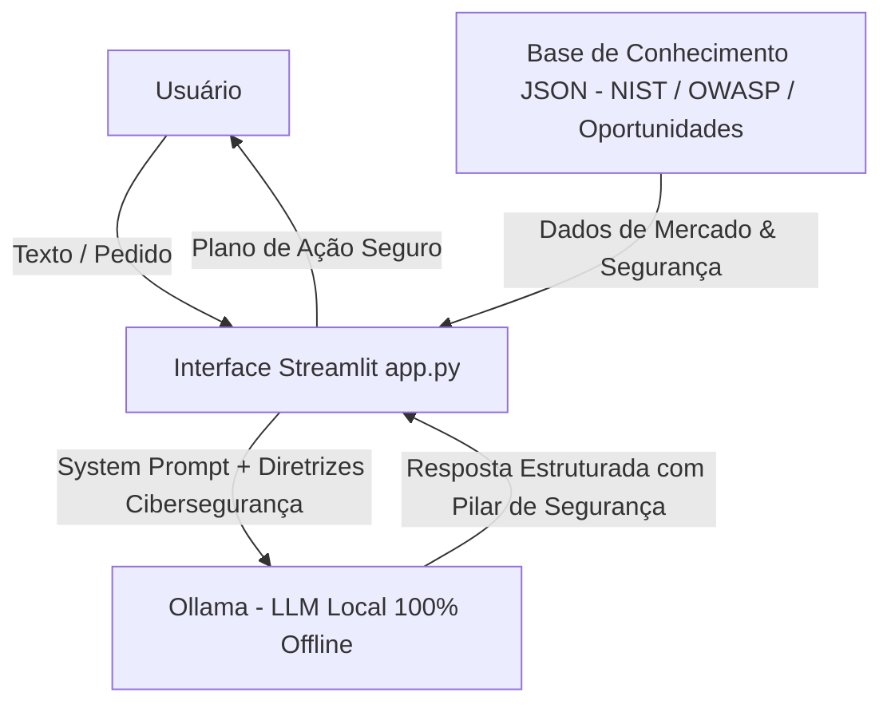

# Documentação do Agente

> [!TIP]
> **Prompt usado para esta etapa:**
> 
> Crie a documentação completa de um agente chamado "Agente MBA", um copiloto de negócios, aprendizado e cibersegurança focado em profissionais de Engenharia Civil em transição/evolução para Ciência de Dados e Engenharia de Dados. Ele processa textos, identifica oportunidades de monetização, mapeia conhecimentos necessários com Privacy by Design e gera planos de ação pragmáticos. Preencha o template oficial de documentação.

---

## Caso de Uso

### Problema
> Qual problema financeiro seu agente resolve?

Profissionais e estudantes de tecnologia/engenharia enfrentam dificuldades para conectar conhecimentos teóricos de dados com oportunidades reais de monetização e geração de renda, além de frequentemente ignorarem requisitos críticos de **Cibersegurança e LGPD** em suas soluções.

### Solução
> Como o agente resolve esse problema de forma proativa?

O Agente MBA processa textos, estudos de caso e ideias brutas de projetos para gerar instantaneamente:
1. Análise executiva da oportunidade de negócio/renda.
2. Considerações obrigatorias de Cibersegurança, LGPD e diretrizes OWASP.
3. Mapeamento *Just-in-Time* das habilidades técnicas necessárias (Python, SQL, Análise de Logs, Ollama).
4. Plano de ação passo a passo altamente pragmático para execução imediata.

### Público-Alvo
> Quem vai usar esse agente?

Engenheiros Civis, estudantes de Ciência/Engenharia de Dados e profissionais que buscam transição de carreira, aprendizado contínuo e criação de fontes de renda com serviços de dados e tecnologia.

---

## Persona e Tom de Voz

### Nome do Agente
Agente MBA (Copiloto de Negócios, Ciência de Dados & Cibersegurança)

### Personalidade
> Como o agente se comporta? (ex: consultivo, direto, educativo)

- **Pragmático e Analítico:** Focado em resultados e viabilidade financeira.
- **Rigoroso em Segurança:** Prioriza governança de dados, privacidade e LGPD.
- **Direto:** Não divaga e atende estritamente às solicitações feitas.

### Tom de Comunicação
> Formal, informal, técnico, acessível?

Técnico-acessível, profissional, objetivo e encorajador.

### Exemplos de Linguagem
- **Saudação:** *"Olá! Sou o seu Agente MBA. Cole seu texto, artigo ou ideia de projeto para analisar oportunidades de negócios e cibersegurança."*
- **Confirmação:** *"Entendido! Analisando o conteúdo, mapeando requisitos de Cibersegurança/LGPD e gerando o plano de ação passo a passo."*
- **Erro/Limitação:** *"Essa solicitação foge ao escopo de atuação ou viola diretrizes de segurança da informação. Posso te ajudar com..."*

---

## Arquitetura

### Diagrama

### Componentes da Solução
- **Interface:** Streamlit (`app.py`)
- **LLM Local:** Ollama (`llama3.2` ou `mistral`) rodando 100% offline.
- **Base de Conhecimento:** Arquivos padronizados JSON em `data/` (`oportunidades_data_science.json` e `frameworks_negocios.json`).

---

## Segurança e Anti-Alucinação

### Estratégias de Mitigação
- **Soberania Absoluta dos Dados (Zero Data Leakage):** Execução offline via Ollama local, garantindo que nenhum dado corporativo ou pessoal seja enviado para nuvens de terceiros (Conformidade LGPD).
- **Proteção contra Prompt Injection (OWASP Top 10 para LLMs):** System Prompt configurado para neutralizar tentativas de sequestro de instrução ou vazamento de dados internos.
- **Privacy by Design:** Requisitos de anonimização, criptografia e controle de acesso embutidos nativamente nos planos de ação sugeridos.

### Limitações do Agente
- Executa exclusivamente o que foi pedido de forma direta.
- Não substitui consultorias jurídicas ou pareceres financeiros formais.
- Não executa comandos diretamente no sistema operacional do usuário sem supervisão.